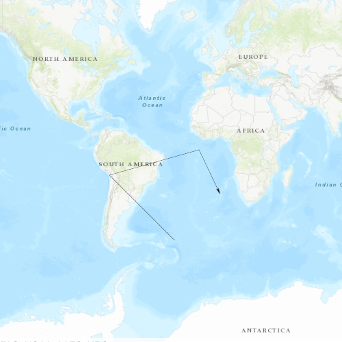

# Custom Pro Arrow Symbol

This sample demonstrates how to consume custom symbols from a style file created in ArcGIS Pro. This particular example shows an arrow line symbol.

## How it works
Custom symbols are created and stored in a Mobile Style File in ArcGIS Pro. Those Symbols are then obtained by using a `SymbolStyle` and calling `fetchSymbol`. The returned `Symbol` is applied to the `SimpleRenderer`, and all Graphics are then displayed with this symbol. *Note* - the stylx file is provided in this repo, but a custom one can be created in ArcGIS Pro. More details about this process are [here](http://pro.arcgis.com/en/pro-app/help/projects/connect-to-a-style.htm) and [here](http://pro.arcgis.com/en/pro-app/help/projects/styles.htm#ESRI_SECTION2_3CF8F3F6EF3A412B9C4ED16D3D69DB15).

## Features
- SymbolStyle
- Symbol
- SimpleRenderer
