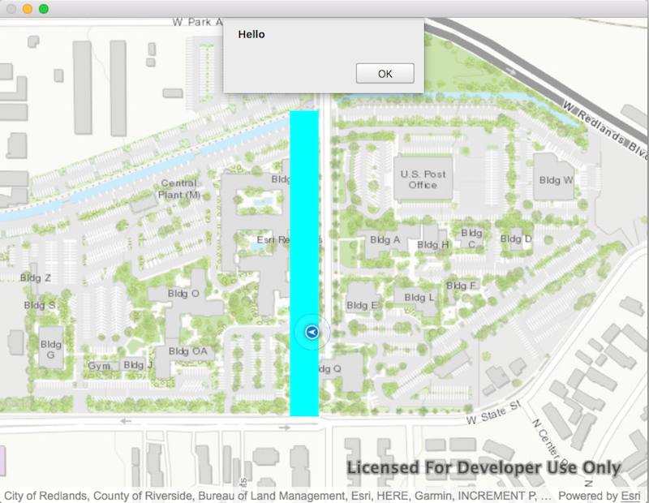

# GeoFence

This sample demonstrates how to take create a GeoFence to alert when a location has entered a specified area.

## How it works
- A `QGeoPositionInfoSource` is created for obtaining the device's location. An NMEA simulation file is specified for purposes of demonstration.
- The `LocationDisplay` is started on the `MapView`, which takes the information from `QGeoPositionInfoSource`, and displays it on a map
- A Polygon is created and displayed as a Graphic. This is the alert zone where we want to be alerted when the current position enters or leaves.
- Whenever the current position updates, the `GeometryEngine::intersects` function is called to see if the current position intersects with the polygon
- If this returns true, a message alert is displayed to the user
